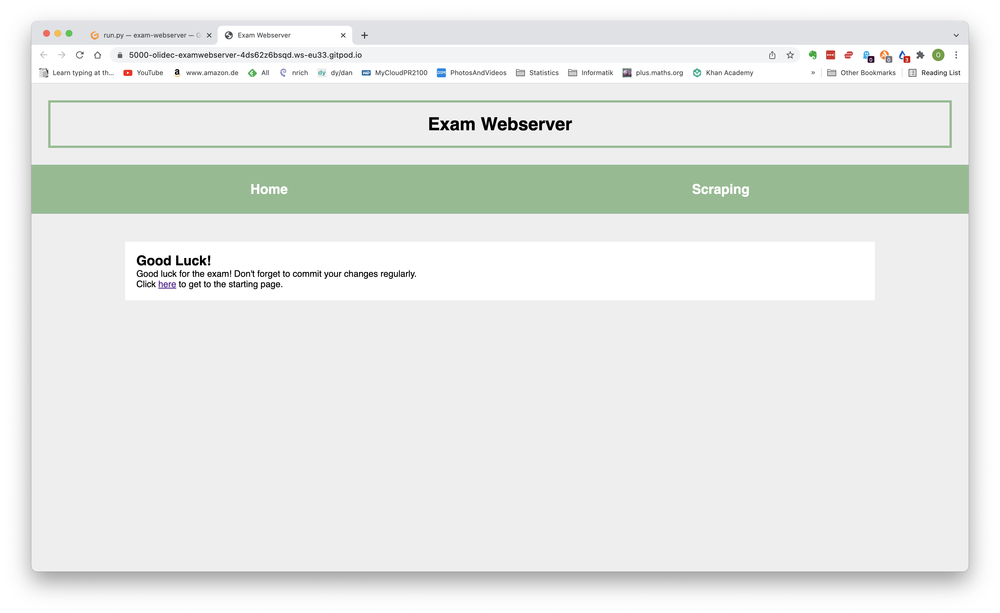

# Exam

This exam is open book which means that you may use any resources at your disposal.

**No direct communication with other persons!!!**

Work with commits. At the latest, after every exercise you should commit with the text *Exercise x finished*.

## Exercise 1 (Fork repository - 1 P.)

Fork this repository to your own github account.

## Exercise 2 (Styling - 3 P.)

Change `main.css` to match the following picture. Don't spend too much time on details.
Please add your styling after the indicated line.

## Exercise 3 (Webscraper - 4 P.)

1. Follow the link *Scraping* in the navigation bar. There you will find a table. What is the CSS-class of the first column of the table?
2. Open the file `scrape.py` and read through the code.
3. Run the file `scrape.py`. What is the output?
4. Change the selector in `scrape.py` such that it only outputs the **bold** elements of the table.

## Exercise 4 (Insert into your own webpage - 4 P.)

1. Add a file `results.html` that extends `base.html`.
2. Add a link to the navigation bar that links to your new page.
3. Show the contents of the file `data.json` on  your new page as a list. The list should have a row *Name* and a row *ID*.

## Exercise 6 (Pull Request - 1 P.)

Create a pull request to the repository from where you initially forked (upstream).

## Exercise 7 (Bonus 1: Create a new Design - 2 P.)

Create a new branch in  which you change the design of your website (starting from the base template).
Create a second pull request from this branch.
